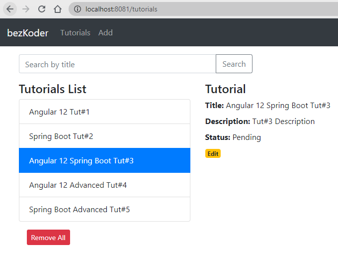

# Angular 12 + Spring Boot example: CRUD Application

Full-stack Angular 12 + Spring Boot Tutorial CRUD Application in that:
- Each Tutorial has id, title, description, published status.
- We can create, retrieve, update, delete Tutorials.
- We can also find Tutorials by title.



> [Spring Boot + Angular 12 CRUD example](https://www.bezkoder.com/angular-12-spring-boot-crud/)

Run both Back-end & Front-end in one place:
> [Integrate Angular 12 with Spring Boot Rest API](https://www.bezkoder.com/integrate-angular-12-spring-boot/)

More Practice:
> [Angular 12 + Spring Boot: File upload example](https://www.bezkoder.com/angular-12-spring-boot-file-upload/)

> [Angular 12 + Spring Boot JWT Authentication](https://www.bezkoder.com/angular-12-spring-boot-jwt-auth/)

## Run Spring Boot application
```
mvn spring-boot:run
```
The Spring Boot Server will export API at port `8081`.

## Run Angular Client
```
npm install
ng serve --port 8081
```
